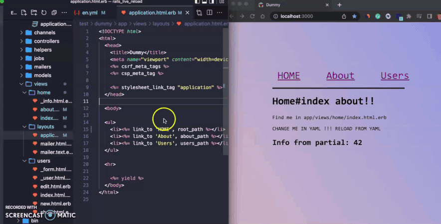

# Rails Live Reload

[](https://www.railsjazz.com)



This is the simplest and probably the most robust way to add live reloading to your Rails app.

Just add the gem and thats it, now you have a live reloading. **You don't need anything other than this gem for live reloading to work**.

Works with:

- views (EBR/HAML/SLIM) (the page is reloaded only when changed views which were rendered on the page)
- partials
- CSS/JS
- helpers (if configured)
- YAML locales (if configured)
- on the "crash" page, so it will be reloaded as soon as you make a fix

The page is reloaded fully with `window.location.reload()` to make sure that every chage will be displayed.

## Usage

Just add this gem to the Gemfile (in development environment) and start the `rails s`.

## Installation

Add this line to your application's Gemfile:

```ruby
group :development do
  gem "rails_live_reload"
end
```

And then execute:
```bash
$ bundle
```

## Configuration

### There are three modes:
1. `:websocket` - This is a default mode which uses websockets to trigger page reloading.
2. `:long_polling` - **[Deprecated]** This mode uses [long polling](https://javascript.info/long-polling) techunique, client opens a connection that will hang until either change is detected, or timeout happens, if later, a new connection is oppened.
3. `:polling` - **[Deprecated]** This mode will use regular polling to detect changes, you can configure custom `polling_interval` (default is 100ms). We recommend using `:long_polling` as it makes much less requests to the server.

Keep in mind that `mode` configuration is **deprecated** and will be removed in the future, with `:websocket` be the only one available, in case you think that modes like `:long_polling` or `:polling` should be preserved feel free to open an issue.

### Create initializer `config/initializers/rails_live_reload.rb`:


```ruby
RailsLiveReload.configure do |config|
  # config.url     = "/rails/live/reload"
  # Available modes are: :websocket (default), :long_polling and :polling
  # config.mode = :websocket

  # This is used with :long_polling mode
  # config.timeout = 30
  # config.long_polling_sleep_duration = 0.1

  # This is used with :polling mode
  # config.polling_interval = 100

  # Default watched folders & files
  # config.watch %r{app/views/.+\.(erb|haml|slim)$}
  # config.watch %r{(app|vendor)/(assets|javascript)/\w+/(.+\.(css|js|html|png|jpg|ts|jsx)).*}, reload: :always

  # More examples:
  # config.watch %r{app/helpers/.+\.rb}, reload: :always
  # config.watch %r{config/locales/.+\.yml}, reload: :always

  # config.enabled = Rails.env.development?
end if defined?(RailsLiveReload)
```

## How it works

There are 3 main parts:

1) listener of file changes (using `listen` gem)
2) collector of rendered views (see rails instrumentation)
3) JavaScript client that communicates with server and triggers reloading when needed

## Notes

The default configuration assumes that you either use asset pipeline, or that your assets compile quickly (on most applications asset compilation takes around 50-200ms), so it watches for changes in `app/assets` and `app/javascript` folders, this will not be a problem for 99% of users, but in case your asset compilation takes couple of seconds, this might not work propperly, in that case we would recommend you to add configuration to watch output folder.

## Contributing

You are welcome to contribute. See list of `TODO's` below.

## TODO

- reload CSS without reloading the whole page?
- smarter reload if there is a change in helper (check methods from rendered views?)
- generator for initializer
- more complex rules? e.g. if "user.rb" file is changed - reload all pages with rendered "users" views
- check with older Rails versions
- tests or specs
- CI (github actions)
- auto reload when rendered controller was changed

## License

The gem is available as open source under the terms of the [MIT License](https://opensource.org/licenses/MIT).

[](https://www.railsjazz.com/?utm_source=github&utm_medium=bottom&utm_campaign=rails_live_reload)
